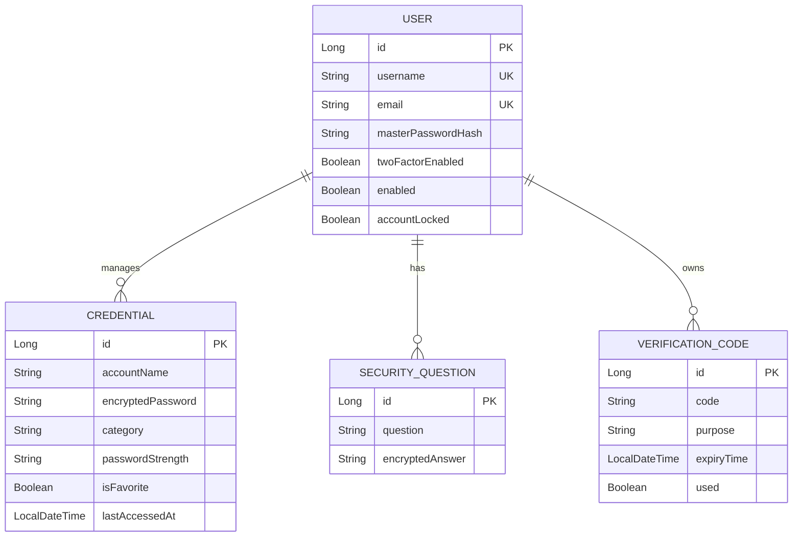
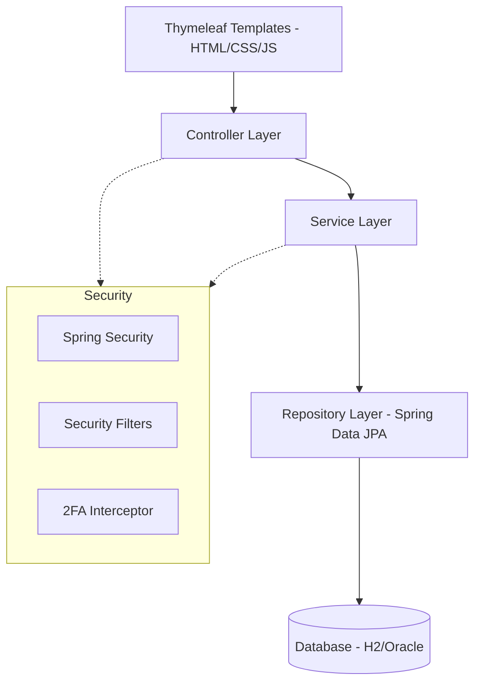

# RevVault Technical Documentation

## 1. Entity Relationship (ER) Diagram
The following diagram illustrates the core data model and relationships within RevVault.

---

## 2. Application Architecture
RevVault follows a clean, monolithic **Layered Architecture** pattern using Spring Boot.

- **Frontend**: Standard HTML5, CSS3 (Custom Theme), and Vanilla JavaScript.
- **Backend**: Spring Boot, Spring Security (Auth & Auth), Spring Data JPA.
- **Security**: BCrypt for passwords, AES-256 for vault encryption.

---

## 3. Security Design

### Master Password Hashing
- We use **BCrypt** with a strong salt to hash the user's master password.
- The raw master password is **never** stored in the database.

### Vault Encryption (AES-256)
- Credential passwords and security question answers are encrypted using **AES-256** in CBC mode with PKCS5 padding.
- A unique **Initialization Vector (IV)** is generated for every encryption operation and stored alongside the encrypted content.

### Two-Factor Authentication (2FA)
- Users can enable 2FA in their profile settings.
- When enabled, an interceptor blocks access to sensitive areas until a 6-digit OTP is verified.
- OTPs are sent to the registered email and logged to the console (for simulation).
- OTPs expire after 5 minutes and are single-use.

### Registration Verification
- New accounts are created in a `disabled` state.
- An OTP is immediately sent to the user's email.
- The account is only `enabled` (activating login) once the OTP is correctly verified.

### Security Audit
- The system automatically scans for:
    - **Weak Passwords**: Using length and character variety checks.
    - **Reused Passwords**: Comparing decrypted passwords within the user's vault.
    - **Old Passwords**: Tracking credentials not updated in the last 90 days.

### Vault Portability (Export/Import)
- Users can export their entire vault as an **encrypted JSON file**.
- The file is encrypted using the application's secret key, ensuring it cannot be read if intercepted without authorization.
